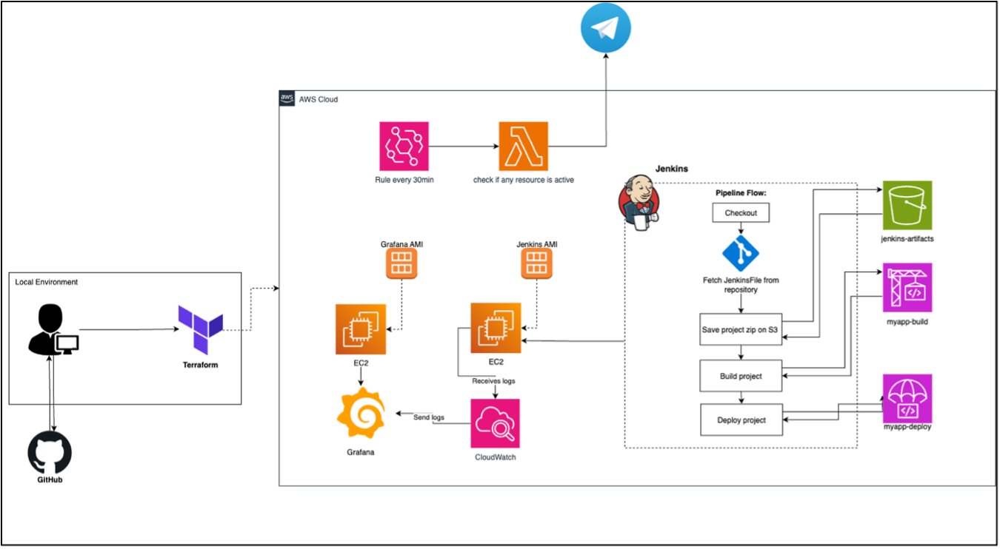

# aws-cicd-jenkins-and-terraform
I built an automated 5min deploy ready ci/cd pipeline on AWS using Jenkins + Terraform: 
The Jenkins uses CodeBuild for packaging, CodeDeploy (Lambda) for canary traffic shifting, and S3 for artifacts. 

As an example: It can publish new Lambda versions and safely shifts the live alias with automatic rollback.

Check it out: 
<!-- Centered and resized -->

  

